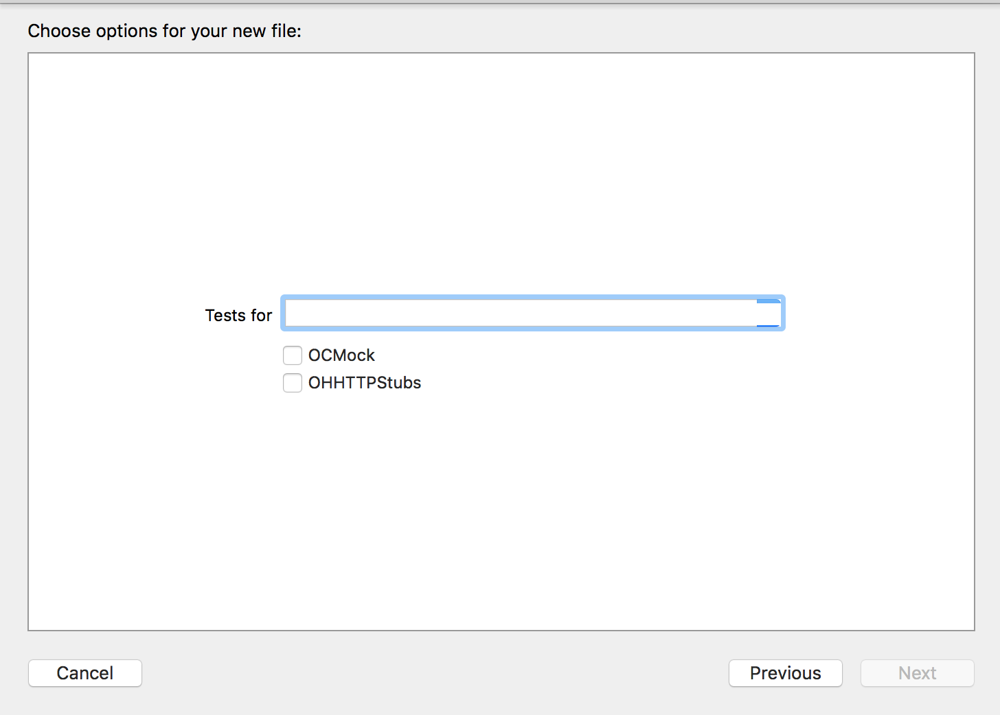

# Xcode-Expecta-File-Template
Xcode file template for unit tests using Expecta with XCTest. Also supports importing OCMock and OHHTTPStubs.

# Installation & Usage

* Copy the folder `Expecta Templates` of this repository into `/Library/Developer/Xcode/Templates/Application/File Templates`.
* Relaunch Xcode and select "File > New File", or use the ⌘N keyboard shortcut.
* Select the "Expecta Templates" category, then select the "Expecta" template, and hit "Next".
* Enter the name of the class you want to create tests for and whether you'd like to use OCMock or OHHTTPStubs.

# License
Xcode Expecta File Template is available under the MIT license. See the LICENSE file for more info.
